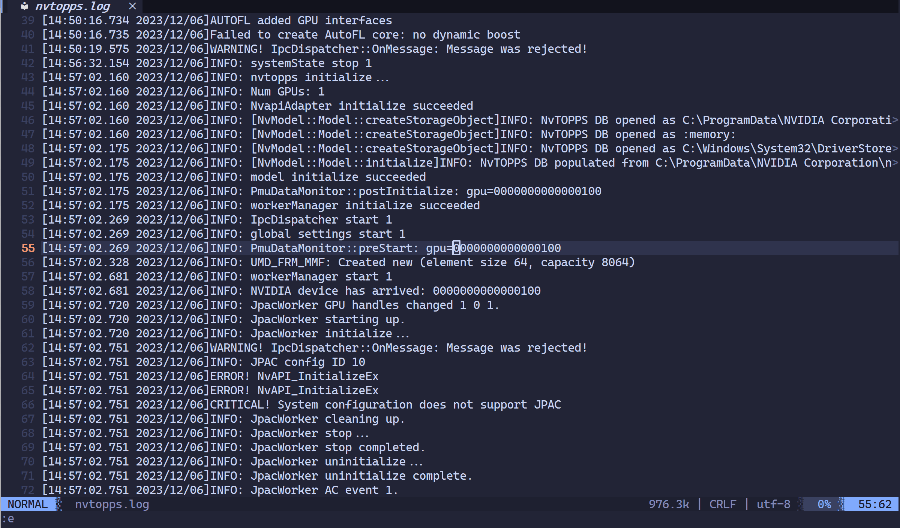

# step-search.lua

Progressive log search plugin for Neovim. Search a large log file by multiple keywords incrementally — results are merged and displayed in order of original line numbers.

## Demo



## Features

- **Progressive search**: search keyword1, then keyword2, results merge automatically sorted by line number
- **Keyword highlighting**: each keyword gets a distinct color (8 colors cycling)
- **Recursive search**: the result buffer is a normal buffer — you can start a new progressive search chain on top of it
- **Configurable display**: split / vsplit / new tab

## Requirements

- Neovim >= 0.8.0

## Installation

### [packer.nvim](https://github.com/wbthomason/packer.nvim)

```lua
use("regomne/nvim-step-search.lua")
```

### [lazy.nvim](https://github.com/folke/lazy.nvim)

```lua
{ "regomne/nvim-step-search.lua", opts = {} }
```

### Local (development)

```lua
-- packer
use("~/path/to/step-search.nvim")

-- lazy
{ dir = "~/path/to/step-search.nvim" }
```

## Configuration

```lua
require("step-search").setup({
  open_cmd = "split",       -- "split" | "vsplit" | "tabnew"
  result_height = 15,       -- window height (only for split mode)
  line_format = "%d: %s",   -- %d = original line number, %s = line content
  highlight = true,         -- highlight matched keywords
})
```

All options are optional. The above shows the defaults.

## Keymaps

The plugin does **not** set any keymaps by default. Call `setup_keymaps(prefix)` to opt-in:

```lua
require("step-search").setup_keymaps("<leader>f")
```

This binds the following keys (assuming `<leader>f` as prefix):

| Key | Mode | Description |
|-----|------|-------------|
| `<leader>ff` | Normal | Search word under cursor |
| `<leader>ff` | Visual | Search selected text |
| `<leader>fi` | Normal | Open input prompt to type a pattern |
| `<leader>fr` | Normal | Reset search state |
| `<leader>fl` | Normal | List searched keywords |

You can use any prefix you like, e.g. `setup_keymaps("<leader>s")` gives `<leader>sf`, `<leader>si`, etc.

## Usage

| Command            | Description                                              |
|--------------------|----------------------------------------------------------|
| `:StepSearch <pattern>` | Search current buffer with Vim regex, append results |
| `:StepSearchReset`      | Clear search state and result buffer                 |
| `:StepSearchList`       | List all searched keywords                           |

### Workflow Example

```
1.  nvim big.log
2.  :StepSearch send        →  result window opens, shows all "send" lines
3.  :StepSearch recv        →  result window updates, "send" + "recv" lines merged by line number
4.  :StepSearch error       →  "error" lines added
5.  Switch to result window
6.  :StepSearch timeout     →  new search chain based on the result buffer
```

## License

MIT
